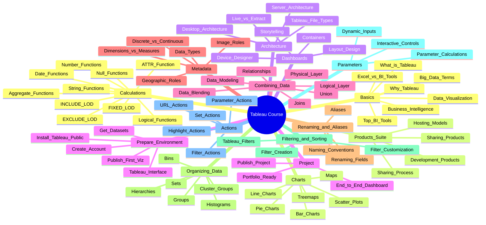

```mermaid
mindmap
  root((Tableau Course))

    Basics
      Big_Data_Terms
      Business_Intelligence
      Data_Visualization
      Excel_vs_BI_Tools
      Top_BI_Tools
      What_is_Tableau
      Why_Tableau

    Products_Suite
      Development_Products
      Sharing_Process
      Hosting_Models
      Sharing_Products

    Architecture
      Live_vs_Extract
      Tableau_File_Types
      Desktop_Architecture
      Server_Architecture

    Prepare_Environment
      Install_Tableau_Public
      Create_Account
      Get_Datasets
      Publish_First_Viz
      Tableau_Interface

    Combining_Data
      Data_Modeling
      Logical_Layer
      Physical_Layer
      Joins
      Union
      Relationships
      Data_Blending

    Metadata
      Data_Types
      Geographic_Roles
      Image_Roles
      Dimensions_vs_Measures
      Discrete_vs_Continuous

    Renaming_and_Aliases
      Naming_Conventions
      Renaming_Fields
      Aliases

    Organizing_Data
      Hierarchies
      Groups
      Cluster_Groups
      Sets
      Bins
      Histograms

    Filtering_and_Sorting
      Tableau_Filters
      Filter_Creation
      Filter_Customization

    Parameters
      Dynamic_Inputs
      Interactive_Controls
      Parameter_Calculations

    Actions
      Filter_Actions
      Highlight_Actions
      URL_Actions
      Set_Actions
      Parameter_Actions

    Calculations
      Number_Functions
      String_Functions
      Date_Functions
      Null_Functions
      Logical_Functions
      Aggregate_Functions
      ATTR_Function
      FIXED_LOD
      INCLUDE_LOD
      EXCLUDE_LOD

    Charts
      Bar_Charts
      Line_Charts
      Pie_Charts
      Scatter_Plots
      Maps
      Treemaps

    Dashboards
      Layout_Design
      Containers
      Device_Designer
      Storytelling

    Project
      End_to_End_Dashboard
      Publish_Project
      Portfolio_Ready
```
