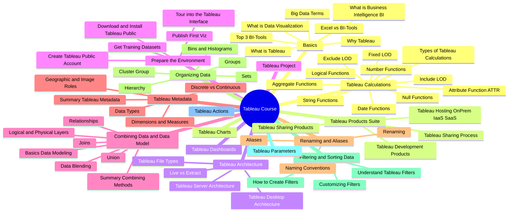

# 📊 Tableau Course — Complete Roadmap

> **Source:** [Full Tableau Course (18+ Hours)](https://www.youtube.com/watch?v=K3pXnbniUcM)  
> A structured guide through all 15 sections of the course, from Basics to a full Tableau Project.

---

## 🗺️ Course Mind Map

---

## 📋 Section-by-Section Breakdown

### 🟣 Section 1 — Tableau Basics
> `00:08:35` → [▶ Watch](https://www.youtube.com/watch?v=K3pXnbniUcM&t=515s)

| Topic | Timestamp | Link |
|---|---|---|
| Big Data Terms | 00:08:37 | [▶](https://www.youtube.com/watch?v=K3pXnbniUcM&t=517s) |
| What is Business Intelligence (BI) | 00:16:54 | [▶](https://www.youtube.com/watch?v=K3pXnbniUcM&t=1014s) |
| What is Data Visualization | 00:19:34 | [▶](https://www.youtube.com/watch?v=K3pXnbniUcM&t=1174s) |
| Excel vs BI-Tools | 00:22:50 | [▶](https://www.youtube.com/watch?v=K3pXnbniUcM&t=1370s) |
| Top 3 BI-Tools | 00:31:28 | [▶](https://www.youtube.com/watch?v=K3pXnbniUcM&t=1888s) |
| What is Tableau | 00:32:22 | [▶](https://www.youtube.com/watch?v=K3pXnbniUcM&t=1942s) |
| Why Tableau | 00:34:50 | [▶](https://www.youtube.com/watch?v=K3pXnbniUcM&t=2090s) |

---

### 🟡 Section 2 — Tableau Products Suite
> `00:39:54` → [▶ Watch](https://www.youtube.com/watch?v=K3pXnbniUcM&t=2394s)

| Topic | Timestamp | Link |
|---|---|---|
| Tableau Development Products | 00:39:54 | [▶](https://www.youtube.com/watch?v=K3pXnbniUcM&t=2394s) |
| Tableau Sharing Process | 00:43:36 | [▶](https://www.youtube.com/watch?v=K3pXnbniUcM&t=2616s) |
| Tableau Hosting (OnPrem, IaaS, SaaS) | 00:54:26 | [▶](https://www.youtube.com/watch?v=K3pXnbniUcM&t=3266s) |
| Tableau Sharing Products | 01:00:24 | [▶](https://www.youtube.com/watch?v=K3pXnbniUcM&t=3624s) |

---

### 🟠 Section 3 — Tableau Architecture
> `01:12:03` → [▶ Watch](https://www.youtube.com/watch?v=K3pXnbniUcM&t=4323s)

| Topic | Timestamp | Link |
|---|---|---|
| Live vs Extract | 01:12:46 | [▶](https://www.youtube.com/watch?v=K3pXnbniUcM&t=4366s) |
| Tableau File Types | 01:14:48 | [▶](https://www.youtube.com/watch?v=K3pXnbniUcM&t=4488s) |
| Tableau Desktop Architecture | 01:19:16 | [▶](https://www.youtube.com/watch?v=K3pXnbniUcM&t=4756s) |
| Tableau Server Architecture | 01:26:39 | [▶](https://www.youtube.com/watch?v=K3pXnbniUcM&t=5199s) |

---

### 🔴 Section 4 — Prepare the Environment
> `01:48:37` → [▶ Watch](https://www.youtube.com/watch?v=K3pXnbniUcM&t=6517s)

| Topic | Timestamp | Link |
|---|---|---|
| Download & Install Tableau Public | 01:48:44 | [▶](https://www.youtube.com/watch?v=K3pXnbniUcM&t=6524s) |
| Create Tableau Public Account | 01:50:06 | [▶](https://www.youtube.com/watch?v=K3pXnbniUcM&t=6606s) |
| Get Training Datasets | 01:51:26 | [▶](https://www.youtube.com/watch?v=K3pXnbniUcM&t=6686s) |
| Publish First Viz | 01:57:18 | [▶](https://www.youtube.com/watch?v=K3pXnbniUcM&t=7038s) |
| Tour into the Tableau Interface | 01:59:33 | [▶](https://www.youtube.com/watch?v=K3pXnbniUcM&t=7173s) |

---

### 🟣 Section 5 — Combining Data & Data Model
> `02:13:01` → [▶ Watch](https://www.youtube.com/watch?v=K3pXnbniUcM&t=7981s)

| Topic | Timestamp | Link |
|---|---|---|
| Basics Data Modeling | 02:13:51 | [▶](https://www.youtube.com/watch?v=K3pXnbniUcM&t=8031s) |
| Logical & Physical Layers | 02:19:57 | [▶](https://www.youtube.com/watch?v=K3pXnbniUcM&t=8397s) |
| Joins | 02:25:07 | [▶](https://www.youtube.com/watch?v=K3pXnbniUcM&t=8707s) |
| Union | 02:33:59 | [▶](https://www.youtube.com/watch?v=K3pXnbniUcM&t=9239s) |
| Relationships | 02:40:54 | [▶](https://www.youtube.com/watch?v=K3pXnbniUcM&t=9654s) |
| Data Blending | 02:57:28 | [▶](https://www.youtube.com/watch?v=K3pXnbniUcM&t=10648s) |
| Summary: Combining Methods | 03:15:57 | [▶](https://www.youtube.com/watch?v=K3pXnbniUcM&t=11757s) |

---

### 🔵 Section 6 — Tableau Metadata
> `03:28:46` → [▶ Watch](https://www.youtube.com/watch?v=K3pXnbniUcM&t=12526s)

| Topic | Timestamp | Link |
|---|---|---|
| Data Types | 03:29:42 | [▶](https://www.youtube.com/watch?v=K3pXnbniUcM&t=12582s) |
| Geographic & Image Roles | 03:48:35 | [▶](https://www.youtube.com/watch?v=K3pXnbniUcM&t=13715s) |
| Dimensions & Measures | 03:53:18 | [▶](https://www.youtube.com/watch?v=K3pXnbniUcM&t=13998s) |
| Discrete vs Continuous | 04:10:57 | [▶](https://www.youtube.com/watch?v=K3pXnbniUcM&t=15057s) |
| Summary: Tableau Metadata | 04:25:34 | [▶](https://www.youtube.com/watch?v=K3pXnbniUcM&t=15934s) |

---

### 🟢 Section 7 — Renaming & Aliases
> `04:27:16` → [▶ Watch](https://www.youtube.com/watch?v=K3pXnbniUcM&t=16036s)

| Topic | Timestamp | Link |
|---|---|---|
| Naming Conventions | 04:27:50 | [▶](https://www.youtube.com/watch?v=K3pXnbniUcM&t=16070s) |
| Renaming | 04:38:28 | [▶](https://www.youtube.com/watch?v=K3pXnbniUcM&t=16708s) |
| Aliases | 04:48:46 | [▶](https://www.youtube.com/watch?v=K3pXnbniUcM&t=17326s) |

---

### 🩵 Section 8 — Organizing Data
> `04:57:26` → [▶ Watch](https://www.youtube.com/watch?v=K3pXnbniUcM&t=17846s)

| Topic | Timestamp | Link |
|---|---|---|
| Hierarchy | 04:58:13 | [▶](https://www.youtube.com/watch?v=K3pXnbniUcM&t=17893s) |
| Groups | 05:16:03 | [▶](https://www.youtube.com/watch?v=K3pXnbniUcM&t=18963s) |
| Cluster Group | 05:28:57 | [▶](https://www.youtube.com/watch?v=K3pXnbniUcM&t=19737s) |
| Sets | 05:38:37 | [▶](https://www.youtube.com/watch?v=K3pXnbniUcM&t=20317s) |
| Bins & Histograms | 06:02:25 | [▶](https://www.youtube.com/watch?v=K3pXnbniUcM&t=21745s) |

---

### 🩵 Section 9 — Filtering & Sorting Data
> `06:12:55` → [▶ Watch](https://www.youtube.com/watch?v=K3pXnbniUcM&t=22375s)

| Topic | Timestamp | Link |
|---|---|---|
| Understand Tableau Filters | 06:13:40 | [▶](https://www.youtube.com/watch?v=K3pXnbniUcM&t=22420s) |
| How to Create Filters | 06:25:11 | [▶](https://www.youtube.com/watch?v=K3pXnbniUcM&t=23111s) |
| Customizing Filters | 06:48:05 | [▶](https://www.youtube.com/watch?v=K3pXnbniUcM&t=24485s) |

---

### 🔴 Section 10 — Tableau Parameters
> `08:03:50` → [▶ Watch](https://www.youtube.com/watch?v=K3pXnbniUcM&t=29030s)

Dynamic inputs that allow users to control calculations, filters, and reference lines interactively.

---

### 🟡 Section 11 — Tableau Actions
> `08:32:09` → [▶ Watch](https://www.youtube.com/watch?v=K3pXnbniUcM&t=30729s)

Interactivity through filter actions, highlight actions, URL actions, set actions, and parameter actions.

---

### 🟣 Section 12 — Tableau Calculations
> `09:05:56` → [▶ Watch](https://www.youtube.com/watch?v=K3pXnbniUcM&t=32756s)

| Topic | Timestamp | Link |
|---|---|---|
| Types of Tableau Calculations | 09:31:33 | [▶](https://www.youtube.com/watch?v=K3pXnbniUcM&t=34293s) |
| Number Functions | 09:53:53 | [▶](https://www.youtube.com/watch?v=K3pXnbniUcM&t=35633s) |
| String Functions | 10:04:12 | [▶](https://www.youtube.com/watch?v=K3pXnbniUcM&t=36252s) |
| Date Functions | 11:27:55 | [▶](https://www.youtube.com/watch?v=K3pXnbniUcM&t=41275s) |
| Null Functions | 12:17:31 | [▶](https://www.youtube.com/watch?v=K3pXnbniUcM&t=44251s) |
| Logical Functions | 12:30:33 | [▶](https://www.youtube.com/watch?v=K3pXnbniUcM&t=45033s) |
| Aggregate Functions | 13:16:13 | [▶](https://www.youtube.com/watch?v=K3pXnbniUcM&t=47773s) |
| Attribute Function ATTR() | 13:35:24 | [▶](https://www.youtube.com/watch?v=K3pXnbniUcM&t=48924s) |
| Fixed (LOD) | 13:59:29 | [▶](https://www.youtube.com/watch?v=K3pXnbniUcM&t=50369s) |
| Exclude (LOD) | 14:08:55 | [▶](https://www.youtube.com/watch?v=K3pXnbniUcM&t=50935s) |
| Include (LOD) | 14:14:26 | [▶](https://www.youtube.com/watch?v=K3pXnbniUcM&t=51266s) |

---

### 🟠 Section 13 — Tableau Charts
> `15:02:51` → [▶ Watch](https://www.youtube.com/watch?v=K3pXnbniUcM&t=54171s)

Build every chart type — bar, line, scatter, pie, maps, treemaps, and more with best-practice guidance.

---

### 🟢 Section 14 — Tableau Dashboards
> `17:55:35` → [▶ Watch](https://www.youtube.com/watch?v=K3pXnbniUcM&t=64535s)

Design and publish professional dashboards with layout containers, device designer, and data storytelling.

---

### 🟣 Section 15 — Tableau Project
> `18:22:08` → [▶ Watch](https://www.youtube.com/watch?v=K3pXnbniUcM&t=66128s)

Capstone project — build a complete, publish-ready Tableau project applying all skills from the course.

---

## ⏱️ Course Timeline Overview

```mermaid
gantt
  title Tableau Course — Section Timeline
  dateFormat HH:mm
  axisFormat %H:%M

  section Foundations
  Basics                    : 00:08, 31m
  Tableau Products Suite    : 00:39, 32m
  Tableau Architecture      : 01:12, 36m
  Prepare the Environment   : 01:48, 24m

  section Data Layer
  Combining Data & Model    : 02:13, 75m
  Tableau Metadata          : 03:28, 59m
  Renaming & Aliases        : 04:27, 30m
  Organizing Data           : 04:57, 75m

  section Analysis
  Filtering & Sorting       : 06:12, 111m
  Tableau Parameters        : 08:03, 28m
  Tableau Actions           : 08:32, 33m
  Tableau Calculations      : 09:05, 357m

  section Output
  Tableau Charts            : 15:02, 172m
  Tableau Dashboards        : 17:55, 26m
  Tableau Project           : 18:22, 30m
```

---

## 📌 Quick Reference

| # | Section | Start Time | Duration |
|---|---|---|---|
| 1 | Tableau Basics | 00:08:35 | ~31 min |
| 2 | Tableau Products Suite | 00:39:54 | ~32 min |
| 3 | Tableau Architecture | 01:12:03 | ~36 min |
| 4 | Prepare the Environment | 01:48:37 | ~24 min |
| 5 | Combining Data & Data Model | 02:13:01 | ~75 min |
| 6 | Tableau Metadata | 03:28:46 | ~59 min |
| 7 | Renaming & Aliases | 04:27:16 | ~30 min |
| 8 | Organizing Data | 04:57:26 | ~75 min |
| 9 | Filtering & Sorting Data | 06:12:55 | ~111 min |
| 10 | Tableau Parameters | 08:03:50 | ~28 min |
| 11 | Tableau Actions | 08:32:09 | ~33 min |
| 12 | Tableau Calculations | 09:05:56 | ~357 min |
| 13 | Tableau Charts | 15:02:51 | ~172 min |
| 14 | Tableau Dashboards | 17:55:35 | ~26 min |
| 15 | Tableau Project | 18:22:08 | ~30 min |

---

*Total course duration: ~18.5 hours*
