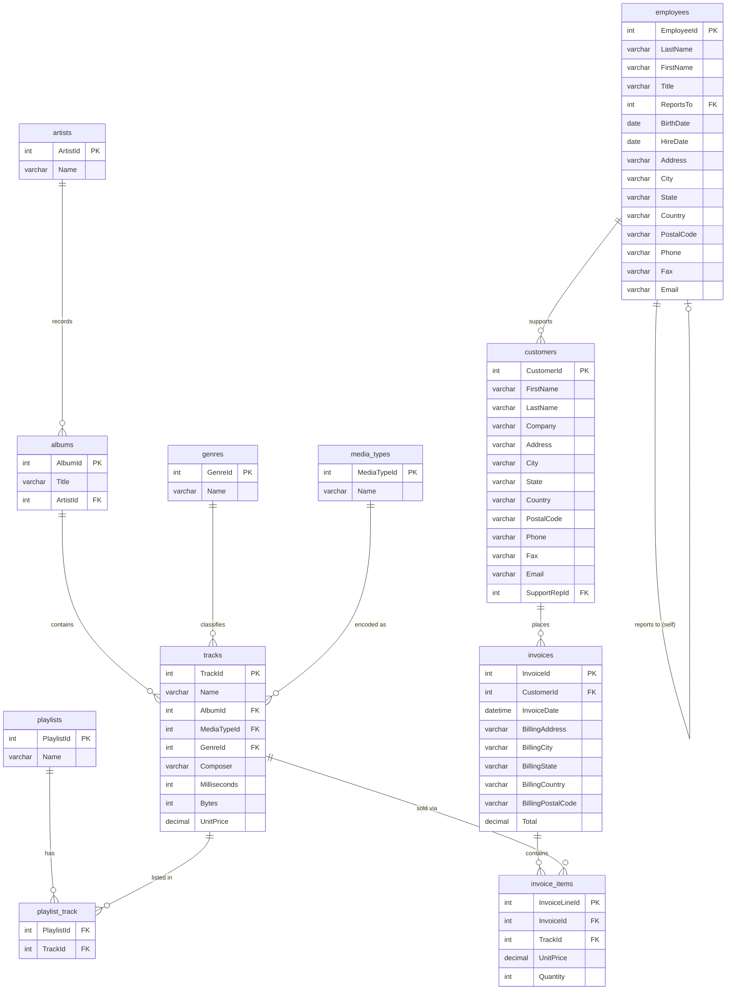

# sTunes Music Store — Database Schema & ER Diagram

The **sTunes** database is a fictional digital music store (think iTunes). It covers the full lifecycle from catalog → purchase → billing, plus employee hierarchy.

---

## ER Diagram



---

## Table Reference

### Catalog Domain

| Table | Rows | Purpose |
|-------|------|---------|
| `artists` | 275 | Every recording artist / band |
| `albums` | 347 | Albums, each belonging to one artist |
| `tracks` | 3 503 | Individual songs; linked to album, genre, and media type |
| `genres` | 25 | Genre lookup (Rock, Jazz, Metal …) |
| `media_types` | 5 | Format lookup (MPEG, AAC, Protected AAC …) |

#### artists
| Column | Type | Note |
|--------|------|------|
| **ArtistId** | INT | PK |
| Name | VARCHAR | |

#### albums
| Column | Type | Note |
|--------|------|------|
| **AlbumId** | INT | PK |
| Title | VARCHAR | |
| ArtistId | INT | FK → artists |

#### tracks
| Column | Type | Note |
|--------|------|------|
| **TrackId** | INT | PK |
| Name | VARCHAR | |
| AlbumId | INT | FK → albums |
| MediaTypeId | INT | FK → media_types |
| GenreId | INT | FK → genres |
| Composer | VARCHAR | nullable (978 missing) |
| Milliseconds | INT | duration |
| Bytes | INT | file size |
| UnitPrice | DECIMAL | $0.99 or $1.99 |

#### genres
| Column | Type | Note |
|--------|------|------|
| **GenreId** | INT | PK |
| Name | VARCHAR | |

#### media_types
| Column | Type | Note |
|--------|------|------|
| **MediaTypeId** | INT | PK |
| Name | VARCHAR | |

---

### Playlist Domain

| Table | Rows | Purpose |
|-------|------|---------|
| `playlists` | 18 | Named playlists |
| `playlist_track` | 8 715 | Junction — which tracks are in which playlist |

#### playlists
| Column | Type | Note |
|--------|------|------|
| **PlaylistId** | INT | PK |
| Name | VARCHAR | |

#### playlist_track *(junction table)*
| Column | Type | Note |
|--------|------|------|
| PlaylistId | INT | FK → playlists (composite PK) |
| TrackId | INT | FK → tracks (composite PK) |

---

### Sales Domain

| Table | Rows | Purpose |
|-------|------|---------|
| `customers` | 59 | Store customers |
| `invoices` | 412 | One invoice per purchase event |
| `invoice_items` | 2 240 | Line items (one row per track per invoice) |

#### customers
| Column | Type | Note |
|--------|------|------|
| **CustomerId** | INT | PK |
| FirstName / LastName | VARCHAR | |
| Company | VARCHAR | nullable |
| Address, City, State, Country, PostalCode | VARCHAR | billing address |
| Phone / Fax / Email | VARCHAR | contact |
| SupportRepId | INT | FK → employees |

#### invoices
| Column | Type | Note |
|--------|------|------|
| **InvoiceId** | INT | PK |
| CustomerId | INT | FK → customers |
| InvoiceDate | DATETIME | |
| BillingAddress … BillingPostalCode | VARCHAR | snapshot of address at purchase |
| Total | DECIMAL | sum of line items |

#### invoice_items
| Column | Type | Note |
|--------|------|------|
| **InvoiceLineId** | INT | PK |
| InvoiceId | INT | FK → invoices |
| TrackId | INT | FK → tracks |
| UnitPrice | DECIMAL | price at time of sale |
| Quantity | INT | usually 1 |

---

### HR Domain

| Table | Rows | Purpose |
|-------|------|---------|
| `employees` | 8 | Staff; self-referencing for org hierarchy |

#### employees
| Column | Type | Note |
|--------|------|------|
| **EmployeeId** | INT | PK |
| LastName / FirstName / Title | VARCHAR | |
| ReportsTo | INT | FK → employees (self-join for org chart) |
| BirthDate / HireDate | DATE | |
| Address … Email | VARCHAR | contact |

---

## How the Tables Connect

```
                ┌──────────┐
                │ employees│◄──────────────────────────────────────────┐
                │          │ (ReportsTo — self-referencing hierarchy)  │
                └──────────┘                                           │
                     │ SupportRepId                                    │
                     ▼                                                 │
                ┌──────────┐     ┌──────────┐     ┌──────────────┐   │
                │customers │────►│ invoices │────►│invoice_items │   │
                └──────────┘     └──────────┘     └──────┬───────┘   │
                                                          │ TrackId   │
                                                          ▼           │
┌─────────┐    ┌────────┐    ┌────────┐    ┌────────────────────┐   │
│ artists │───►│ albums │───►│ tracks │◄───│  playlist_track     │   │
└─────────┘    └────────┘    └───┬────┘    └────────────────────┘   │
                                  │              ▲                    │
                            ┌─────┴──────┐  ┌───┴──────┐            │
                            │  genres    │  │playlists │            │
                            └────────────┘  └──────────┘            │
                            ┌────────────┐                           │
                            │media_types │                           │
                            └────────────┘                           │
                                                                      │
                                  employees ─────────────────────────┘
```

### Key Foreign Key Chains

| Query goal | Join path |
|------------|-----------|
| Track → Artist | `tracks` → `albums` → `artists` |
| Revenue by Genre | `invoice_items` → `tracks` → `genres` |
| Revenue by Artist | `invoice_items` → `tracks` → `albums` → `artists` |
| Sales Rep performance | `employees` → `customers` → `invoices` |
| Playlist contents | `playlists` → `playlist_track` → `tracks` |

---

## Quick Stats (from EDA)

| Metric | Value |
|--------|-------|
| Total tracks | 3 503 |
| Avg track duration | 6.56 min |
| Track prices | $0.99 – $1.99 |
| Missing composer field | 978 tracks |
| Total customers | 59 |
| Total invoices | 412 |
| Total invoice line items | 2 240 |
| Employees | 8 |
| Playlists | 18 |
| Genres | 25 |
